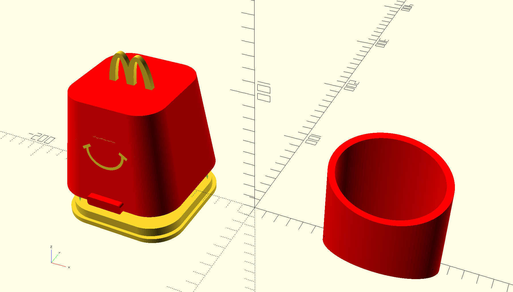

# openscad-macdo
a version of the macdo tableware, print it instead of stealing it




To build from source execute script build-all.sh.

```bash
$> ./build-all.sh
burgerbox_friesbox_full
friesbox_only
burgerbox_without_base
base_only
multimaterial_burgerbox_without_base
multimaterial_smile
multimaterial_m_macdo
```

## print one color
Use base_only.stl to print the burger box base.
Use burgerbox_without_base.stl to print the burger box without base.
Use friesbox_only.stl to print fries boxe.

## print multicolor

Use base_only.stl to print the burger box base.
Use multimaterial_burgerbox_without_base.stl, with first material to print the burger box without base, merge with multimaterial_m_macdo.stl and multimaterial_smile.stl with second material.
Use friesbox_only.stl to print fries boxe.
